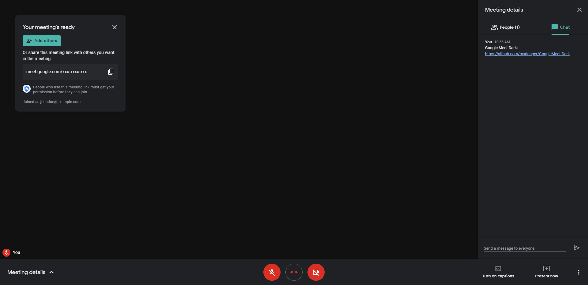
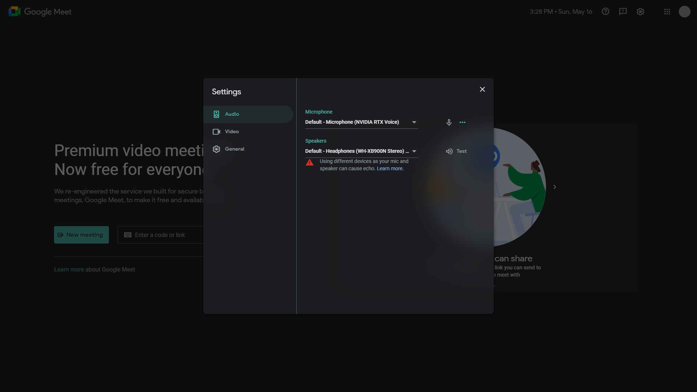

# GoogleMeet-Dark

A dark theme for [Google Meet](https://meet.google.com/) using Google's own dark theme color palette. Features [automatic theme switching](https://developer.mozilla.org/en-US/docs/Web/CSS/@media/prefers-color-scheme) enabled by default.

Currently, only the [legacy experience](https://support.google.com/meet/answer/10550593) is supported.

## Installation
1. Install [Stylus for Firefox](https://addons.mozilla.org/en-US/firefox/addon/styl-us/), [Chrome](https://chrome.google.com/webstore/detail/stylus/clngdbkpkpeebahjckkjfobafhncgmne), [Opera](https://addons.opera.com/en-gb/extensions/details/stylus/), or [Cascadea for Safari](https://cascadea.app/).
2. Install [googlemeet-dark.user.css](https://raw.githubusercontent.com/mxdanger/GoogleMeet-Dark/main/googlemeet-dark.user.css).

## Preview

